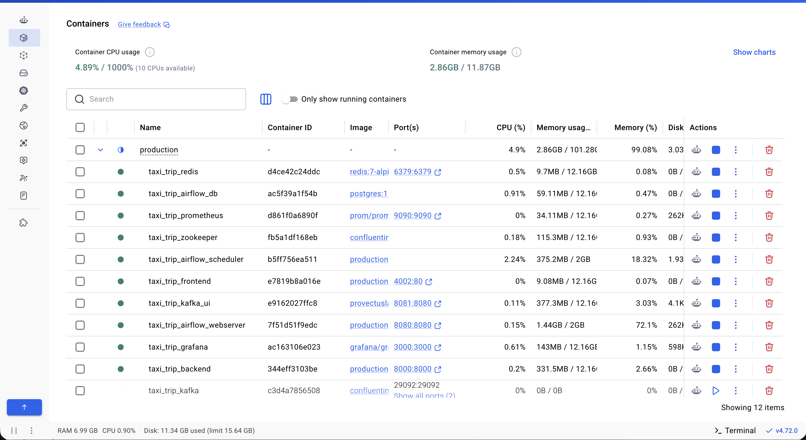
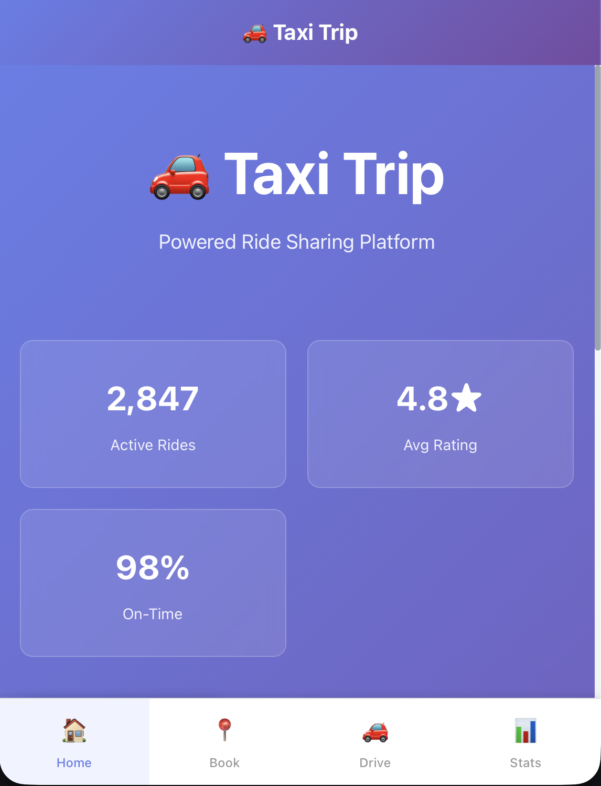
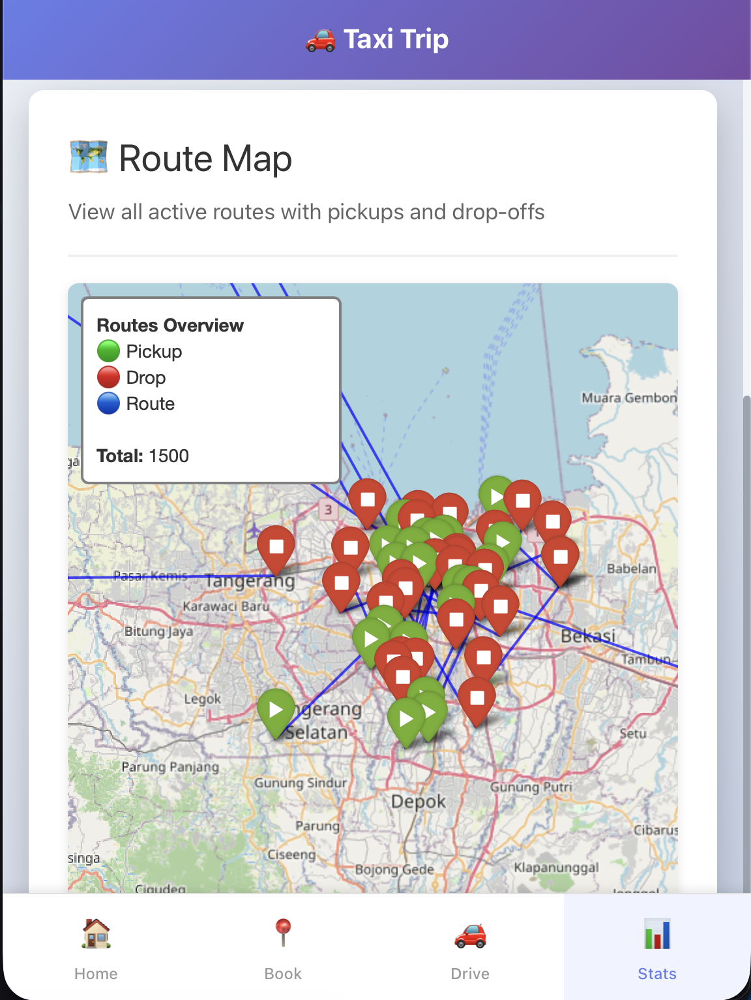
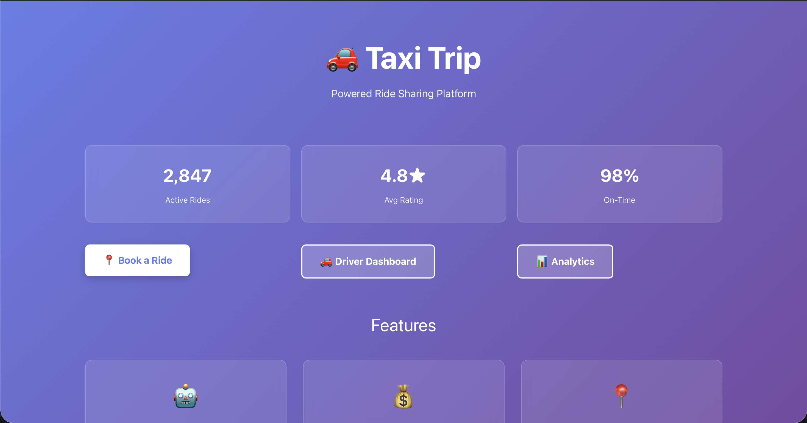

## 🚖 Taxi trip enterprise project

## 🎯 Goals project

## 🚀 Build taxi tracking for similar in tracking ride
- Maps tracking - Google maps
- Machine learning to ensure the project is enterprise production for better learnt
- Cluster fast way tracks
- Artificial Intelligence for the best method recommendation in taxi trip ways
- Navigating with prediction on the road with proper
    - Best price chosen
    - Best track on the road
- Get models to predict and embed
    - Machine learning models (Supervised learning ML models)
    - Deep learning models (Neural Network models)

## 🤖 Taxi Trip Project Construction Engine System
- Services are constructed reliable for engineering system as here as
    - Core ML
        • Feature engineering for data preprocessing to clear data missing
    - Business Logic
        • Ensure business logic toward to advantage cost management
    - Matching / Routing engine system
        • Route engine recommendation to answer the best road way trip chosen
    - Experimentation
        • A/B Testing inferences in otherway
    - Monitoring
        • Monitor models are using on production
- Build Google Maps in a notebook cell Google maps display enterprise for taxi trip distance
    - Interactive map generated with 10 routes
    
    - google maps previews
    
    - plot heatmap for maps traffic
    
    - prediction with features on the trip
    
    - API Testing to ensure prediction is reliable
    

- Build Engineering system focused on AI/ML, Data Engineering to settle on the production, feature recommendation engineering
    - Target machine learning model
        - Predict Price
        - Predict completed at ride (timestamp for completing ride)
        - predict VTAT = Vehicle Time to Arrive (pickup time)
    - Docker containeraize dependencies system to run in wraps
    
    - Create Database on PostgreSQL by occuring with docker
    
    - API integration based on database postgresql connection
        - Driver tracking for ride history
        
        - 
    - Airflow for orchestration data ingesting    
        - SQL data ingestion by airflow monitoring in server
        
        
        - Airflow cluster activity to monitor data inference
        
    - Kafka to retrive data click button from customer
    
- Build UI Taxi apps for user (Production Grade)
    - UI display in mobile apps
    
    - Location stats drop and pickup location
    
    ------------------------------------------------------------
    - UI display in website
    