## 🚖 Taxi trip enterprise project

## 🎯 Goals project

## 🚀 Build taxi tracking for similar in tracking ride
- Maps tracking - Google maps
- Machine learning to ensure the project is enterprise production for better learnt
- Cluster fast way tracks
- Artificial Intelligence for the best method recommendation in taxi trip ways
- Navigating with prediction on the road with proper
    - Best price chosen
    - Best track on the road
- Get models to predict and embed
    - Machine learning models (Supervised learning ML models)
    - Deep learning models (Neural Network models)

## 🤖 Taxi Trip Project Construction Engine System
- Services are constructed reliable for engineering system as here as
    - Core ML
        • Feature engineering for data preprocessing to clear data missing
    - Business Logic
        • Ensure business logic toward to advantage cost management
    - Matching / Routing engine system
        • Route engine recommendation to answer the best road way trip chosen
    - Experimentation
        • A/B Testing inferences in otherway
    - Monitoring
        • Monitor models are using on production
- [Data Science]: Build Google Maps in a notebook cell Google maps display enterprise for taxi trip distance
    - Interactive map generated with 10 routes
    
    - google maps previews
    
    - plot heatmap for maps traffic
    
    - prediction with features on the trip
    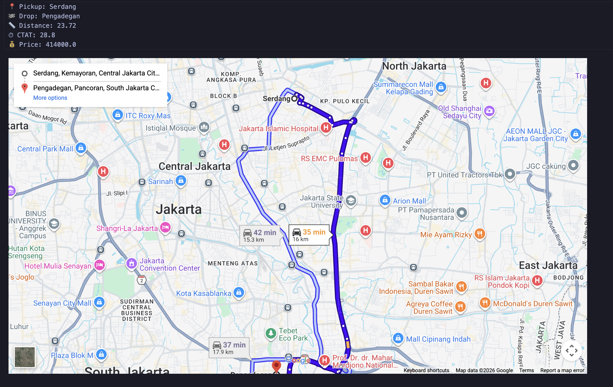
    - API Testing to ensure prediction is reliable
    

- [Frontend]: Build UI Taxi apps for user (Production Grade)
     - UI display in website
        - Home display in website
        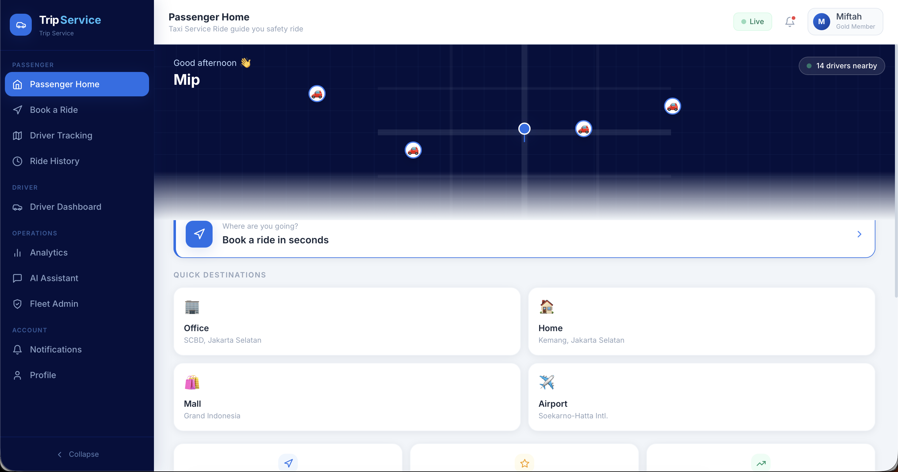
        - Dashboard analytics
        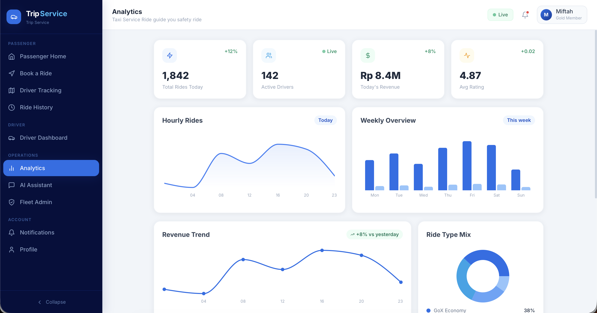
        - Driver dashboard
        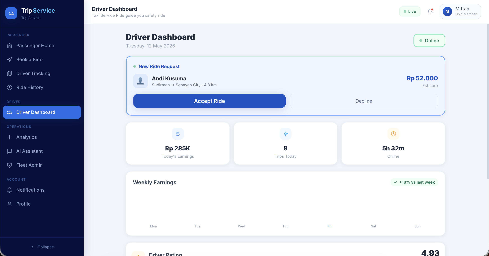
        - Account trip service & payment method
        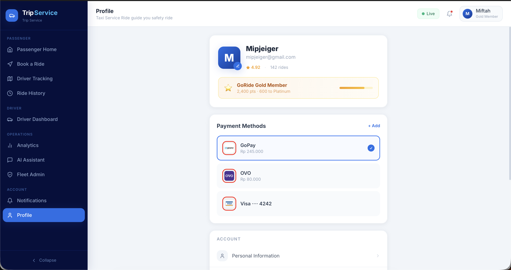
    ------------------------------------------------------------
    - UI display in mobile appss
        - Home display in mobile apps
        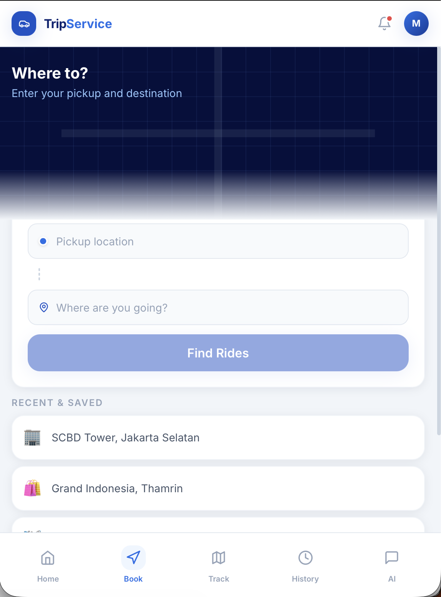
        - Pick up & drop location
        
        - Rides history
        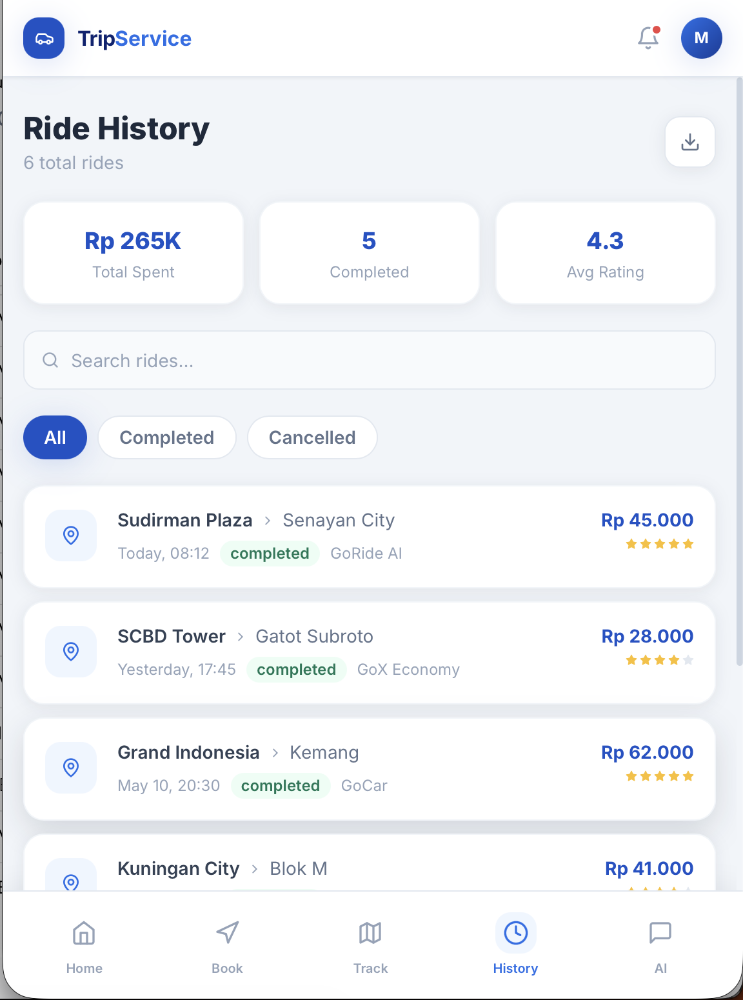
        - Driver around tracking
        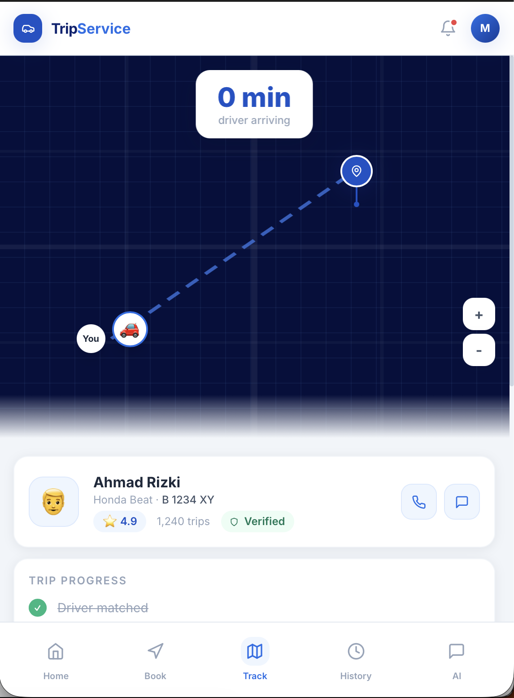

- [Fullstack AI/ML Engineer]: Build MLOps Engineering system focused on AI/ML, Data Engineering to settle on the production, feature recommendation engineering
    - Target machine learning model
        - Predict Price
        - Predict completed at ride (timestamp for completing ride)
        - predict VTAT = Vehicle Time to Arrive (pickup time)
    - Docker containeraize dependencies system to run in wraps
    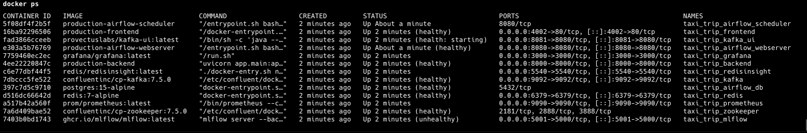
    - Create Database on PostgreSQL by occuring with docker
    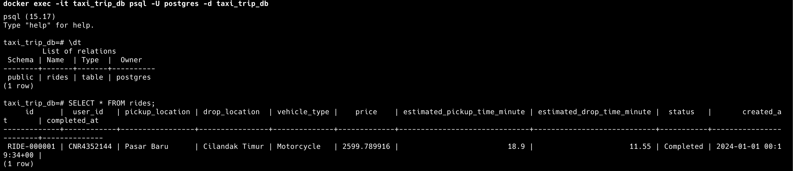
    - Table rides as database in supabase
    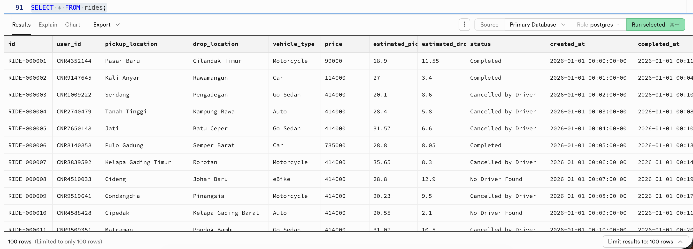
    - API integration based on database postgresql connection
        - Driver tracking for ride history
        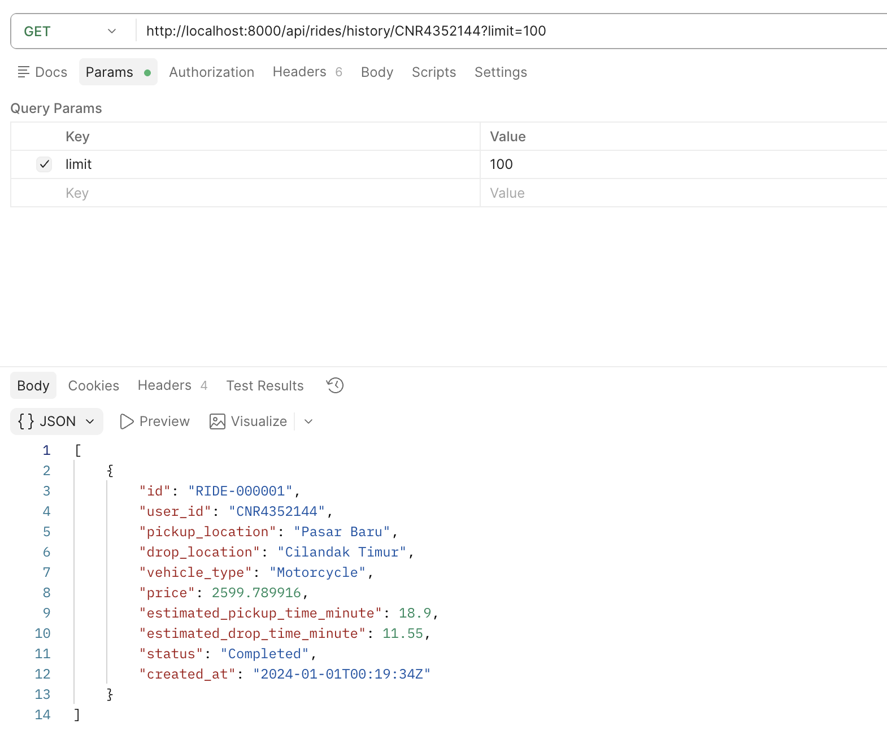
        - LLM Chat answering question about routes in Jakarta
        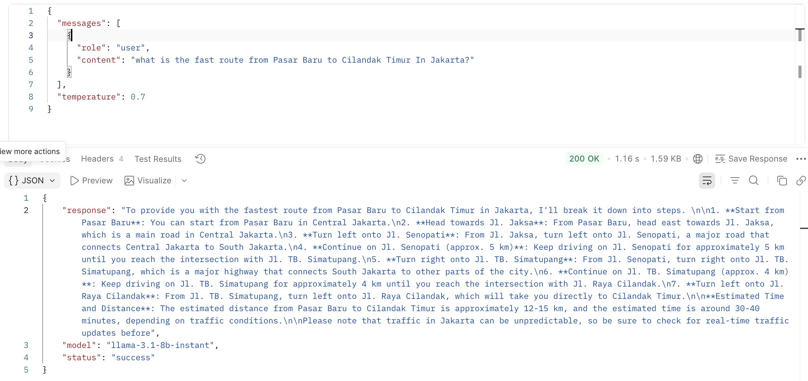
    - Airflow for orchestration data ingesting    
        - SQL data ingestion by airflow monitoring in server
        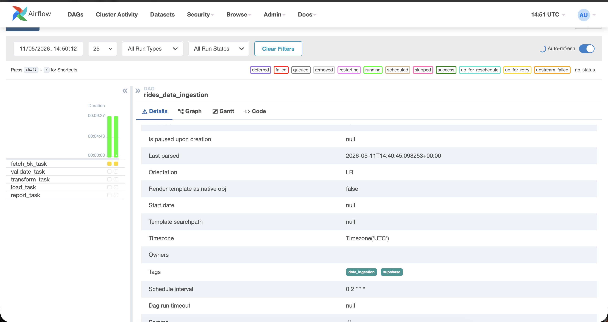
        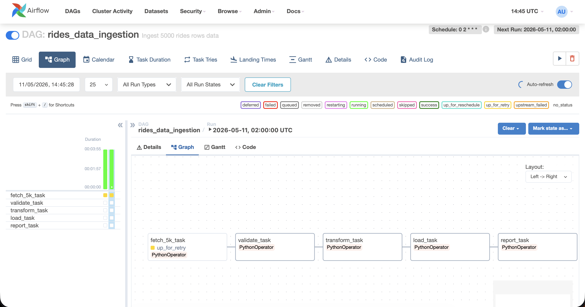
        - Airflow cluster activity to monitor data inference
        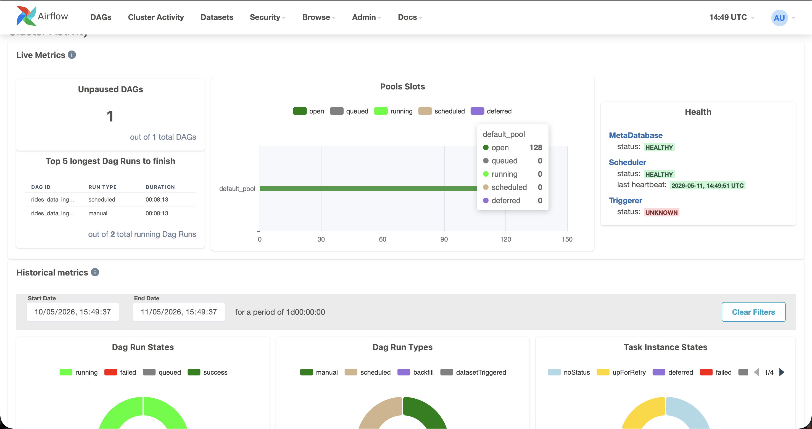
    - Kafka to retrive data click button from customer
    
- 🎯 GOALS ENGINEERING PROJECT
- Step 1 — Frontend (Website & Mobile App)
    Frontend is the user interaction layer.
    This is where:
    passengers book rides
    drivers accept rides
    maps are displayed
    ETA appears
    pricing is shown
    Frontend itself does not process ML models directly.
    It sends requests to the backend API.
    Usually:
    Website → React / Next.js
    Mobile → Flutter / React Native / Kotlin / Swift
    What Happens
    Passenger opens app and requests a ride.
    Frontend collects:
    pickup location
    destination
    ride type
    Then sends request to backend.
    Example Plaintext
    [Frontend]

    User opens taxi app
    → enters pickup location
    → enters destination
    → clicks "Book Ride"

    Frontend sends API request:
    POST /predict-trip

- Step 2 — FastAPI (Main Backend Service)
    FastAPI
    FastAPI becomes the central backend system.
    It acts as:
    API gateway
    business logic processor
    ML serving layer
    FastAPI receives requests from frontend and coordinates all services.
    What Happens
    FastAPI:
    validates request
    checks authentication
    communicates with Redis
    stores data into PostgreSQL
    sends events to Kafka
    serves ML predictions
    Example Plaintext
    [FastAPI]

    Request received:
    pickup = Mall A
    destination = Airport

    FastAPI validates request
    → user authenticated
    → request accepted

- Step 3 — PostgreSQL / Supabase (Persistent Storage)
    PostgreSQL
    Supabase
    This is the permanent storage system.
    All critical business data is stored here.
    What Happens
    Backend stores:
    ride request
    user info
    driver info
    trip history
    payment logs
    This ensures data is safe and recoverable.
    Example Plaintext
    [PostgreSQL]

    Ride request stored:
    - trip_id = TRX001
    - user_id = U123
    - pickup = Mall A
    - destination = Airport
    - status = searching_driver

- Step 4 — Redis (Real-Time Cache)
    Redis provides ultra-fast temporary data access.
    Taxi systems need instant responses.
    What Happens
    Redis stores:
    nearby drivers
    active sessions
    ETA cache
    surge pricing cache
    This avoids repeated heavy database queries.
    Example Plaintext
    [Redis]

    Nearby drivers cached:
    - Driver A = 1.2 km
    - Driver B = 2.1 km

    ETA cache found:
    Estimated pickup = 4 minutes

- Step 5 — Kafka (Real-Time Event Streaming)
    Apache Kafka
    Kafka streams real-time events between services.
    Instead of services communicating directly, they publish events into Kafka.
    What Happens
    FastAPI publishes:
    ride request events
    GPS events
    payment events
    prediction events
    Other systems consume these events independently.
    Example Plaintext
    [Kafka]

    Event published:
    topic = ride_requests

    Payload:
    {
    trip_id: TRX001,
    pickup: Mall A,
    destination: Airport
    }

- Step 6 — Databricks (Large Scale Processing & ML Training)
    Databricks
    Databricks processes large-scale data and trains ML models.
    It handles heavy computations beyond normal backend capability.
    What Happens
    Databricks:
    processes trip history
    analyzes traffic patterns
    engineers ML features
    trains ETA prediction models
    Example Plaintext
    [Databricks]

    Processing:
    - 5 million trip records
    - weather data
    - traffic data
    - GPS movement

    Generated feature:
    average_speed_during_rain

- Step 7 — Airflow (Pipeline Automation)
    Apache Airflow
    Airflow automates engineering workflows.
    Instead of manually retraining models, Airflow schedules everything automatically.
    What Happens
    Airflow orchestrates:
    data extraction
    preprocessing
    feature engineering
    model training
    validation
    deployment
    Example Plaintext
    [Airflow]

    Scheduled task started:
    02:00 AM daily

    Pipeline:
    Extract Data
    → Clean Data
    → Generate Features
    → Train Model
    → Evaluate Accuracy

- Step 8 — MLflow (Model Lifecycle Management)
    MLflow
    MLflow tracks and manages trained models.
    It stores:
    model versions
    experiment metrics
    training metadata
    What Happens
    MLflow compares model performance.
    Best-performing model gets promoted to production.
    Example Plaintext
    [MLflow]

    Experiment Results:

    Model v12:
    RMSE = 4.8

    Model v13:
    RMSE = 3.9

    Model v13 promoted to Production

- Step 9 — FastAPI Loads Approved Production Model
    FastAPI
    After MLflow approves the model, FastAPI uses it for live inference.
    This is the production prediction stage.
    What Happens
    FastAPI:
    loads approved ML model
    receives prediction request
    generates ETA prediction
    Example Plaintext
    [FastAPI Production Inference]

    Production model loaded:
    eta_model_v13

    Prediction request:
    Airport → Hotel

    Predicted ETA:
    12 minutes

- Step 10 — Evidently AI (ML Monitoring)
    Evidently AI
    Evidently monitors production ML quality.
    Real-world conditions constantly change.
    What Happens
    Evidently checks:
    feature drift
    target drift
    prediction instability
    It compares:
    training data
    vs
    live production data
    Example Plaintext
    [Evidently AI]

    Drift detected:
    average_trip_duration changed

    Training:
    15 minutes

    Production:
    26 minutes

    Alert:
    Model quality degrading

- Step 11 — Prometheus (Metrics Collection)
    Prometheus
    Prometheus continuously collects operational metrics.
    It monitors system health.
    What Happens
    Prometheus measures:
    API latency
    CPU usage
    memory usage
    Kafka lag
    prediction latency
    Example Plaintext
    [Prometheus]

    Metrics collected:
    API latency = 220ms
    CPU usage = 68%
    Prediction latency = 45ms
    Kafka lag = 0

- Step 12 — Grafana (Visualization Dashboard)
    Grafana
    Grafana visualizes metrics into dashboards.
    Engineers monitor the entire system visually.
    What Happens
    Grafana displays:
    ride requests
    active drivers
    API latency
    ML metrics
    drift alerts
    infrastructure health
    Example Plaintext
    [Grafana Dashboard]

    System Status:
    ✔ API Healthy
    ✔ Kafka Stable
    ✔ Redis Healthy
    ⚠ Drift Alert Detected
    ✔ Database Operational

    Current Requests:
    2,300 rides/minute
    Complete End-to-End System Flow
    Frontend
    → User books ride

------------------------------------------------------------
- FastAPI
    → validates request

- PostgreSQL
    → stores trip transaction

- Redis
    → retrieves nearby drivers

- Kafka
    → streams ride event

- Databricks
    → processes large-scale trip data

- Airflow
    → automates retraining pipeline

- MLflow
    → manages model versions

- FastAPI
    → serves approved production model

- Evidently AI
    → monitors ML quality

- Prometheus
    → collects infrastructure metrics

- Grafana
    → visualizes system health